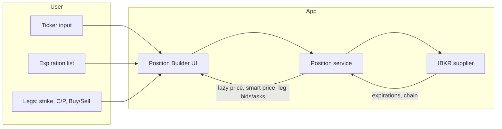
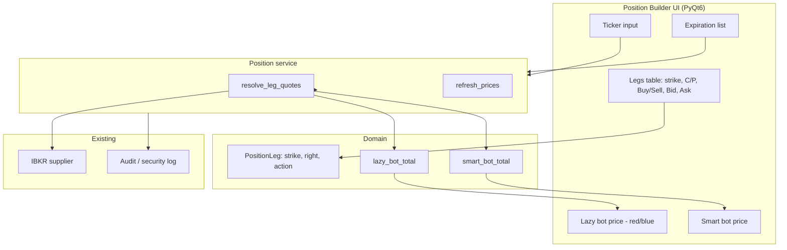

# Position Builder UI – Architecture

## Overview

The Position Builder lets the user enter a ticker, pick an expiration, add option legs (strike + Call/Put + Buy/Sell), and see two composite prices: **Lazy bot** (bid/ask by leg side) and **Smart bot** (mid). Prices are updated live from IBKR.

## High-level flow



## Data flow

```mermaid
sequenceDiagram
    participant U as User
    participant UI as Position Builder UI
    participant Svc as Position service
    participant IBKR as IBKR supplier

    U->>UI: Enter ticker
    UI->>Svc: load_expirations(ticker)
    Svc->>IBKR: connect(); get_expirations()
    IBKR-->>Svc: list of dates
    Svc-->>UI: expirations
    UI->>UI: Fill expiration list box

    U->>UI: Select expiration, add legs (strike, C/P, Buy/Sell)
    loop Every N seconds
        UI->>Svc: get_leg_prices(ticker, expiration, legs)
        Svc->>IBKR: get_chain(expiration)
        IBKR-->>Svc: OptionQuote per strike/right
        Svc->>Svc: resolve each leg to bid/ask, compute lazy & smart total
        Svc-->>UI: leg bids/asks, lazy_total, smart_total
        UI->>UI: Update table and summary labels
    end
```

## Component diagram



## Price rules

| Leg action | Lazy bot uses | Smart bot uses |
|------------|----------------|----------------|
| Buy        | Ask (debit)    | Mid = (Bid+Ask)/2 |
| Sell       | Bid (credit)   | Mid = (Bid+Ask)/2 |

- **Total** = sum of debits (buys) minus sum of credits (sells).
- **Lazy total > 0** → show as red (debit); **< 0** → show as blue (credit).
- Same for Smart total.

## File layout

```
src/spx_options/
  position/
    __init__.py
    leg.py            # PositionLeg, LegAction
    pricing.py        # lazy_bot_total, smart_bot_total
    builder_service.py # get_expirations, get_leg_quotes (resolve legs to bid/ask)
  ui/
    position_builder.py   # PyQt6 window (worker threads for IBKR calls)
  audit.py               # log_connection_open / log_connection_close (resolved IP)
docs/
  ARCHITECTURE_POSITION_BUILDER.md
  RUN_POSITION_BUILDER.md   # how to run with no prompts
tests/
  test_position_pricing.py
  test_builder_service.py
run_position_builder.ps1    # from project root: .\run_position_builder.ps1
```

## Audit (open IP / connections)

The IBKR supplier logs connection open and close to the security logger with **resolved IP**:

- **CONNECTION_OPEN** – after `connect()`: host, resolved_ip, port, clientId
- **CONNECTION_CLOSE** – before `disconnect()`: host, resolved_ip, port

See `src/spx_options/audit.py` and usage in `suppliers/ibkr.py`.

## How to run

From project root, no input required:

```powershell
.\run_position_builder.ps1
```

See **docs/RUN_POSITION_BUILDER.md** for prerequisites and test commands.
